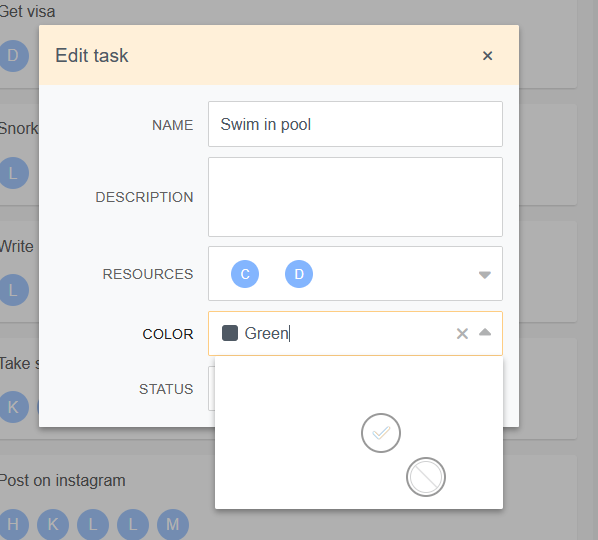
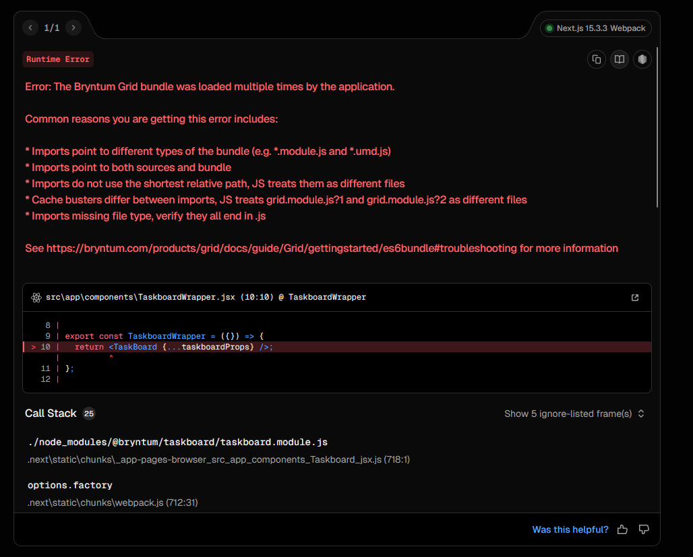

#### Bryntum gantt-taskboard test

Hello, this repo is a reproduction of an error we get when trying to display a bryntum Gantt and a bryntum Taskboard on a same page with tabs

In this repo, you'll find a page with 2 tabs, a Gantt one and a Taskboard one, it's a reproduction of the error I have on the website.

I tried two different configurations:

- 1st One, This is the original error on the website:

  -Bryntum Gantt version: 6.1.9

  -Bryntum Taskboard version: 6.2.0

So, in this configuration the error is this:



As you can see in this screenshot, the color picker doesn't display colors, and the picked color is not showing on the left (the black rectangle), it is only a CSS issue, after looking for solutions with dev console on my navigator I saw that there is a kiss with "bg-color: transparent" that makes the colors disappear. This occurs only in this configuration where we display the two on the same page or with tabs.

- 2nd One, Found after trying to correct the 1st one:
  Because of the previous issue, I tried to change the version of the Gantt to match the Taskboard, so:

  -Bryntum Gantt version: 6.2.3

  -Bryntum Taskboard version: 6.2.3

Here is the error I get when I try to put a Gantt and a Task Board in the Same page or within tabs inside a page


to run the project :

```shell
npm run dev
```
